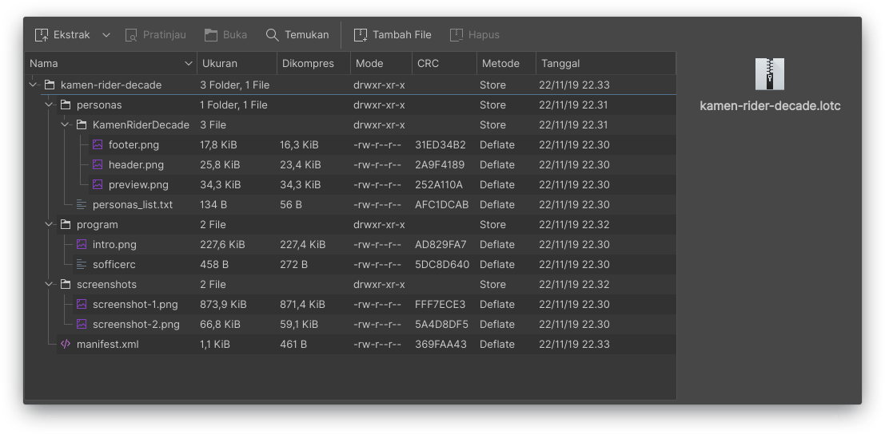

# Generate LOTC

Basically, lotc files are zip archives containing the files that you created before. The easiest way to create this file is to archive your theme folder above in zip format, then change the zip extension to lotc by renaming it. The directory structure in the archive can be seen in the image below.

If so, you can import your theme by clicking the import button in the LOTC main dialog. If successful, then when your theme is clicked, a detail window will appear as shown below.

Click Activate to apply the theme, or Remove to delete the theme from the list.


you can use command:`zip -r theme-name.lotc theme-name/`


