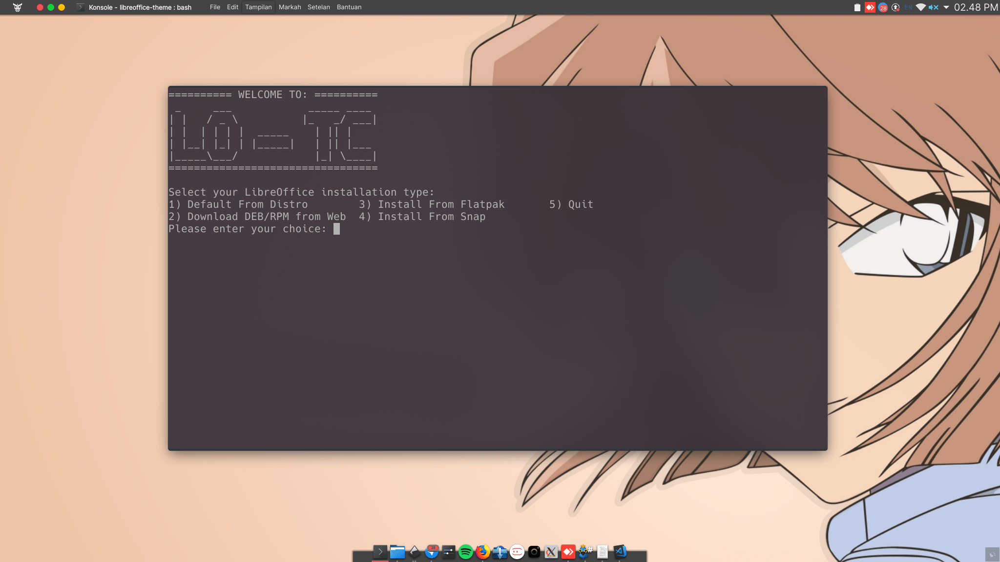
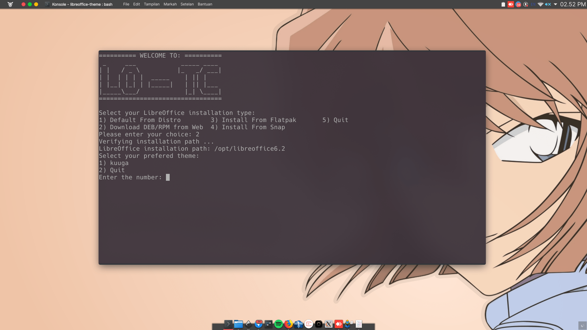
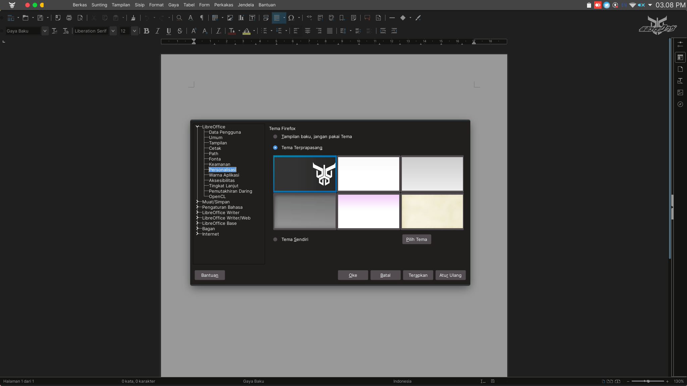

# Themes Instalation

We provide several themes that you can choose and use directly, but you can also add your own themes that you want. Step by step how to create own them will provided in the next section.

To run LO-TC, please follow the following steps. Make sure Git is installed on your operating system.

```bash
$ git clone https://github.com/raniaamina/libreoffice-theme.git
$ cd libreoffice-theme
$ bash install.sh
```



LibreOffice supports many installation methods, each method has its own directory for storing LibreOffice configuration files. For that case, please choose the appropriate installation method so the theme can be installed correctly.

The next step, is to determine the theme you want to install. A list of available themes can be seen in the `themes` directory.



To install a theme, you are required to have root access. You will be asked to enter the root password after you choose your prefered theme to be installed. Bside of that, make sure that the LibreOffice application is not being used/running.

After the installation is complete, you can choose whether to immediately apply the selected theme or not. You can activate the theme manually through menu `tool` -&gt; `Options`-&gt;`Personalization` in LibreOffice. Look at the following picture.



> **SPECIAL NOTE** For now the LO-TC can run well on the Debian, openSUSE, Fedora, Ubuntu, and derivative distributions. For distros other than those mentioned, they must enter the LibreOffice path manually. Consider the following picture.
>
> 

### Remove the LO-TC Theme

To remove theme via LO-TC just run the command

```bash
$ bash uninstall.sh
```

then select the theme you want to delete.


