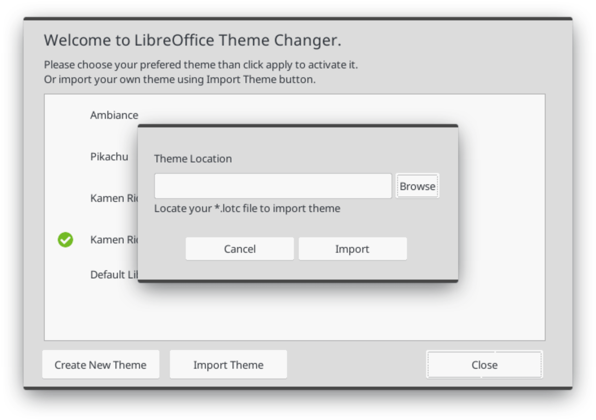

# Interface

### LO-TC Interface


This is main dialog of LO-TC. All of imported theme will listed at white area. Green Mark indicate that the theme is active or used now. To see the details of each theme, just click the theme name, and detail of theme will appear. Look at picture.


Click Activate if you wanna apply this theme, or Remove to remove this theme from LO-TC list.

LO-TC can help you to creat your own theme. We use `*.lotc` as main format for LO-TC theme file. At the main dialog, click Create New Theme in order to start creating your own theme.

Please complete the required data as you see at this dialog, including Author Name, Theme Name, and path to save your directory theme.


Click Create button, to finish this step. Please go to path where your theme saved. Your next task is completing that directory so look like this tree. Don't forget to add several information about your theme into manifest.xml file.

```bash
theme-name
├── manifest.xml
├── personas
│   ├── theme-name
│   │   ├── footer.png
│   │   ├── header.png
│   │   └── preview.png
│   └── personas_list.txt
├── program
│   ├── intro.png
│   └── sofficerc
└── screenshots
    ├── screenshot-3.png
    ├── screenshot-2.png
    └── screenshot.png
```

We've provide complete guide about step by step to create own LO-TC Theme, please refer to link bellow

* LOTC Theme Guide
  * [English Version](create-own-theme-guideline/)
  * [Bahasa Indonesia](membuat-tema-lotc/)

Let say your theme already finish, you can import your theme to LO-TC by clicking Import Theme.

, navigate the file manager to directory where the lotc file saved. If the import success, your new theme will listed in main dialog.



#### 

