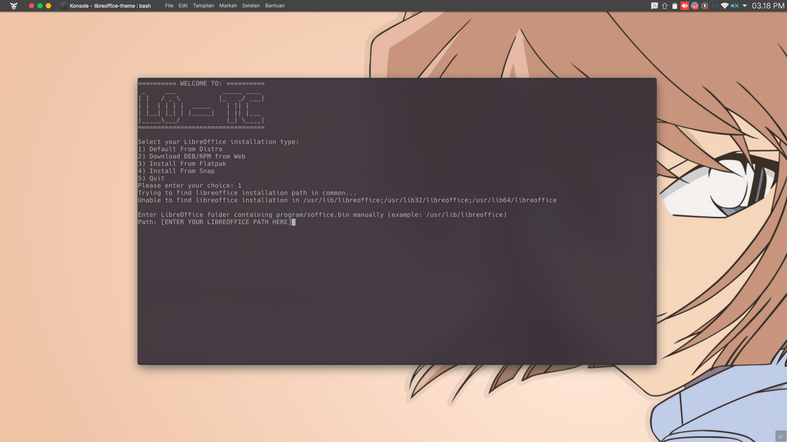

# Memasang Tema

Kami menyediakan beberapa tema yang dapat Anda pilih dan gunakan secara langsung, namun Anda juga dapat menambahkan sendiri tema yang Anda inginkan. Langkah-langkah membuat tema ini akan dibahas pada bagian selanjutnya.

Untuk dapat menjalankan LO-TC, silakan ikuti tahapan-tahapan berikut ini. Pastikan Git sudah terpasang pada sistem operasi Anda.

```bash
$ git clone https://github.com/raniaamina/libreoffice-theme.git
$ cd libreoffice-theme
$ bash install.sh
```


LibreOffice mendukung banyak metode pemasangan, masing-masing metode memiliki direktori tersendiri untuk menyimpan berkas konfigurasi LibreOffice. Untuk itu, silakan pilih metode pemasangan yang sesuai agar tema dapat dipasang dengan lancar.

Langkah selanjutnya, adalah menentukan tema yang ingin dipasang. Daftar tema yang tersedia dapat dilihat di direktori `themes`.


Untuk memasang tema, Anda diharuskan memiliki akses root. Anda akan diminta untuk memasukkan sandi root setelah Anda menentukan tema yang akan dipasang. Selain itu, pastikan pula bahwa aplikasi LibreOffice tidak sedang digunakan/berjalan.

Setelah pemasangan selesai, Anda dapat memlih apakah akan langsung menerapkan tema terpilih atau tidak. Anda dapat mengaktifkan tema secara manual melalui menu `perkakas` --&gt; `Opsi`--&gt; `Personalisasi`. Perhatikan gambar berikut.


**Catatan khusus**

Untuk saat ini LO-TC dapat berjalan baik pada distribusi Debian, openSUSE, Fedora, Ubuntu, dan distro-dsitro turunannya. Untuk distro-distro selain yang disebutkan harus memasukkan path LibreOffice secara manual. Perhatikan gambar berikut.



### Manghapus Tema LO-TC

Untuk mengahpus tema via LO-TC cukup jalankan perintah

```bash
$ bash uninstall.sh
```

kemudian pilih tema yang ingin dihapus.

