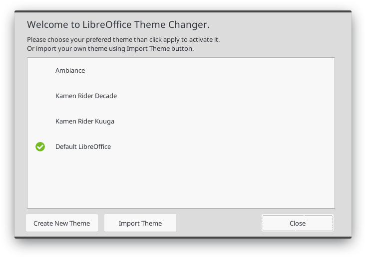

# Inisialisasi Direktori Kerja

Untuk membuat teme LOTC, silakan buka terlebih dahulu ekstensi Theme Changer melalui menu **Perkakas** -&gt; **Pengaya** -&gt; **Theme Changer**.

Kemudian klik "Create New Theme" sehingga terbuka jendela dialog seperti pada gambar di bawah ini.

Lengkapi isian pada dialog tersebut. Pada isian paling bawah adalah lokasi tempat tema baru Anda akan di simpan. Klik Create jika sudah selesai.

Pada lokasi yang telah Anda tentukan, akan muncul direktori tema dengan nama sesuai yang telah Anda tentukan.

