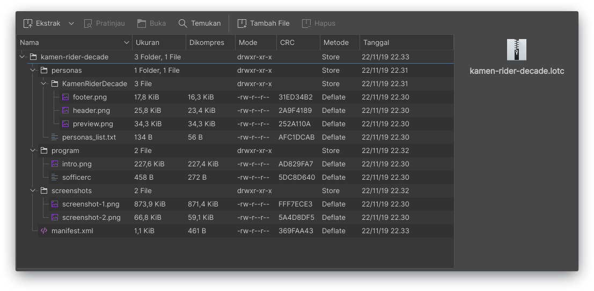

# Membuat Berkas \*.lotc

Pada dasarnya, berkas lotc tak lain hanyalah arsip terstruktur yang memuat berkas di atas. Cara termudah untuk membuat berkas ini adalah mengarsipkan folder tema Anda di atas dengan format zip, kemudian ubah ekstensi zip menjadi lotc dengan cara me-_rename_-nya. Struktur direktori pada arsip dapat dilihat pada gambar di bawah ini.

Jika sudah, Anda dapat mengimpor tema Anda dengan mengeklik tombol impor pada _main dialog_ LOTC. Jika berhasil, maka ketika tema Anda diklik maka akan muncul jendela detail seperti gambar berikut ini.

Klik Activate untuk menerapkan tema, atau Remove untuk menghapus tema dari daftar.

